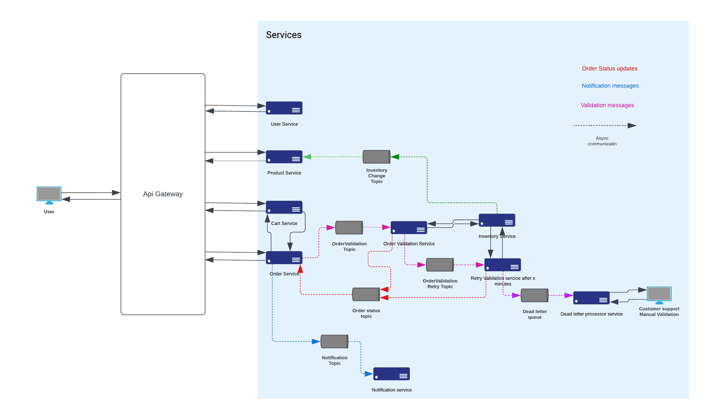

# Microservices-Project 
 
> [!WARNING]
> This software is unfinished. Keep your expectations low.
>
> Please be aware that this project is currently in an unfinished state and may have incomplete features or issues. While we are actively working on it, there might be bugs, missing functionality, or unpolished areas. 
> 
> If you encounter any issues, have feedback, or want to provide tips or suggestions for improvement, we welcome your input. Feel free to reach out to us at `mellau.mark12@gmail.com` with your feedback and concerns. Your input will be greatly appreciated in helping us improve this project.

## Introduction

This README provides an overview of the Microservices Project, an architecture that comprises multiple microservices to create a scalable and modular system. The project is designed to handle various aspects of a hypothetical e-commerce platform, including user management, product catalog, shopping cart, order processing, inventory management, and notifications.

The project employs a combination of synchronous and asynchronous communication between services to ensure efficient data exchange and scalability. The core technologies used in this project include `WebClient` for synchronous communication, Apache Kafka for asynchronous messaging, Spring Cloud Netflix for service discovery, and Spring Cloud Gateway for the microservices gateway.

## Table of Contents
1. [Services](#services)
2. [Synchronous Communication](#synchronous-communication)
3. [Asynchronous Communication](#asynchronous-communication)
4. [Service Discovery](#service-discovery)
5. [Microservices Gateway](#microservices-gateway)

## Services

The project consists of the following microservices:

1. **Product Service**: Manages product information, including product catalog and details.
2. **User Service**: Handles user management, authentication, and authorization.
3. **Cart Service**: Manages shopping carts, including adding, removing, and checking out items.
4. **Order Service**: Processes and manages customer orders.
5. **Inventory Service**: Manages product inventory levels.
6. **Notification Service**: Handles notifications to users, such as order confirmations and updates.

Each microservice is designed to be self-contained and independently deployable, allowing for flexibility and scalability.

## Synchronous Communication

Synchronous communication is utilized for real-time interactions between services. This project uses the following technology:

- **WebClient**: Synchronous communication is achieved through the use of the Spring Framework's `WebClient`, which allows for HTTP-based communication between microservices. This is suitable for scenarios where immediate responses are required, such as retrieving product information or user data.

## Asynchronous Communication

Asynchronous communication is used to decouple services and ensure high availability. Apache Kafka is chosen as the messaging platform for asynchronous communication:

- **Kafka**: Apache Kafka is employed for message queuing and event streaming. It enables asynchronous interactions between microservices, such as handling order processing, inventory updates, and notifications, without the need for immediate responses. This architecture ensures scalability and fault tolerance.

## Service Discovery

Service discovery is essential for the dynamic registration and discovery of microservices. Spring Cloud Netflix is employed for this purpose:

- **Spring Cloud Netflix**: This framework provides service discovery capabilities through technologies like Netflix Eureka, allowing microservices to locate and communicate with one another dynamically. It enhances the resilience and scalability of the architecture.

## Microservices Gateway

A microservices gateway is used to route incoming requests to the appropriate microservice and manage cross-cutting concerns. Spring Cloud Gateway is chosen for this task:

- **Spring Cloud Gateway**: Spring Cloud Gateway serves as a reverse proxy that handles routing, load balancing, and security. It acts as the entry point to the microservices architecture, providing a unified interface for client applications and handling tasks like authentication, rate limiting, and request routing.

With these technologies in place, the Microservices Project creates a robust and flexible architecture for building and scaling an e-commerce platform, ensuring reliable communication, high availability, and ease of management.

Please refer to the individual documentation of each microservice for specific implementation details and endpoints.
